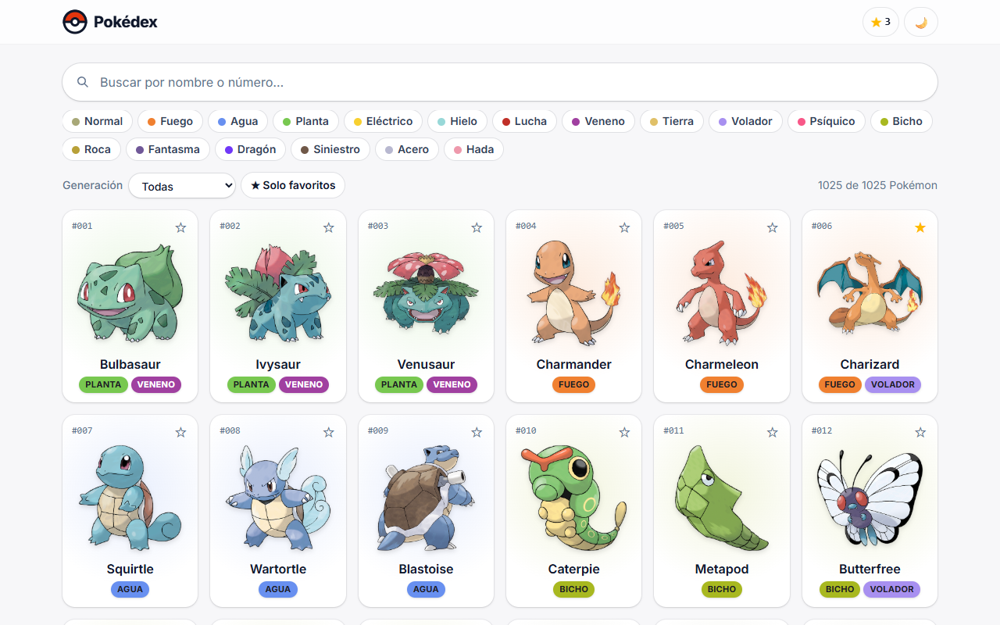
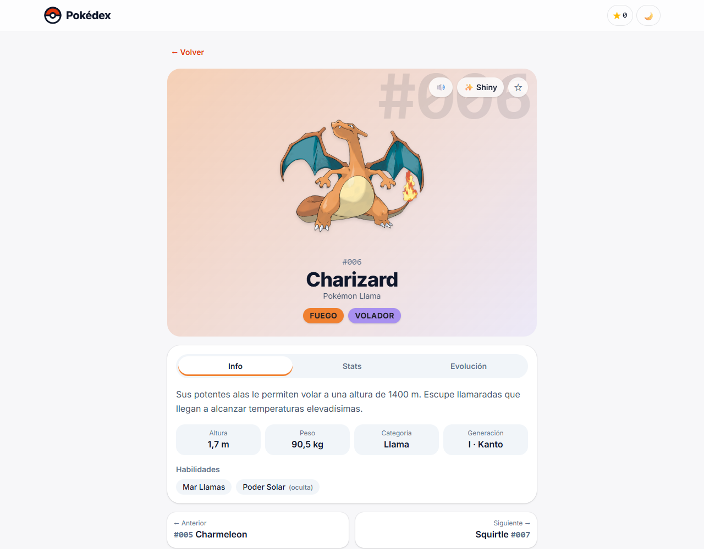
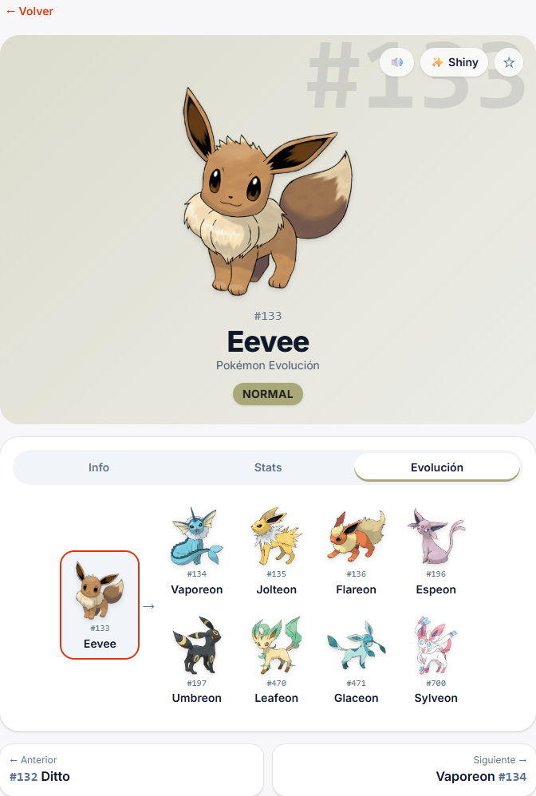
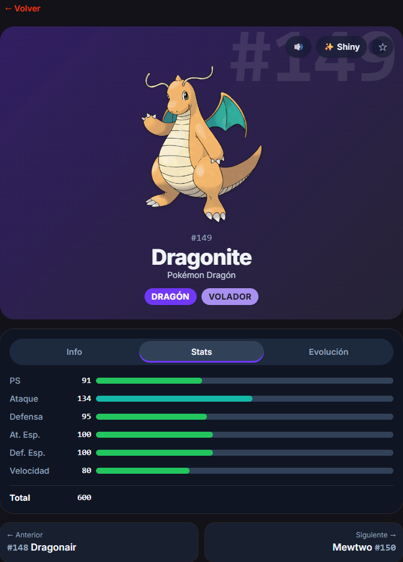
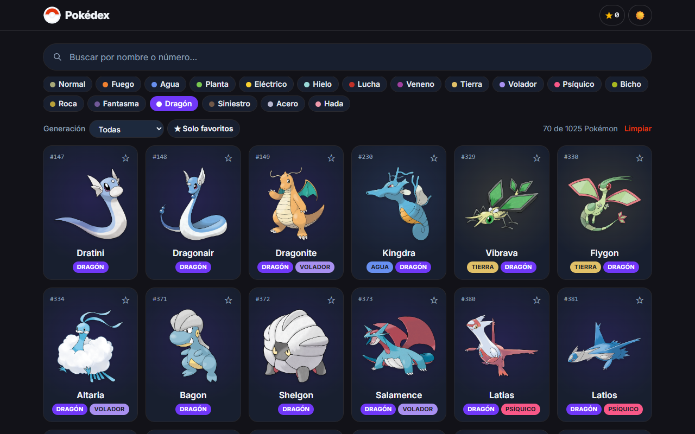
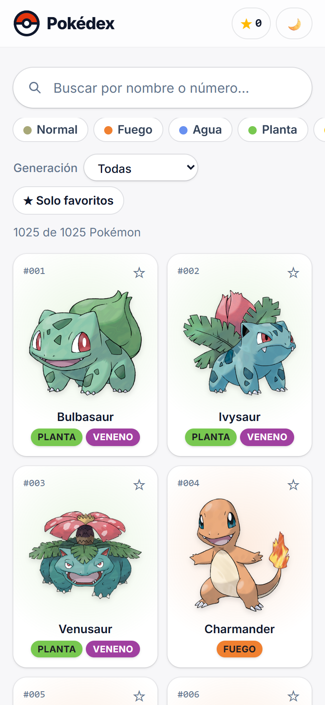
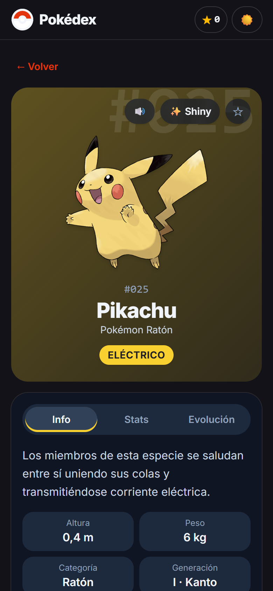

# Pokédex

Pokédex web con los **1025 Pokémon**: búsqueda, filtros por tipo y generación, detalle con stats y cadena evolutiva, favoritos y modo oscuro. Los datos vienen de [PokéAPI](https://pokeapi.co).

**▶ Demo:** https://jorgecheverria.github.io/pokedex/

[](https://github.com/JorgeCheverria/pokedex/actions/workflows/deploy.yml)



## Funcionalidades

- **Listado con scroll infinito**: carga de 24 en 24, con skeletons mientras llega cada imagen.
- **Búsqueda** por nombre o número (`#025`). Ignora mayúsculas y acentos y espera 300 ms de pausa (debounce) antes de filtrar.
- **Filtros** por los 18 tipos y las 9 generaciones, combinables entre sí.
- **Los filtros viven en la URL**, así que se pueden compartir: [`#/?type=dragon`](https://jorgecheverria.github.io/pokedex/#/?type=dragon)
- **Detalle** de cada Pokémon:
  - descripción, categoría, altura, peso y habilidades en español;
  - stats base con barras animadas;
  - cadena evolutiva con ramas (por ejemplo, las 8 evoluciones de Eevee);
  - versión shiny y grito del Pokémon.
- **Navegación** al anterior o siguiente, también con las flechas `←` `→`. Al volver desde el detalle se conserva la posición en la lista.
- **Favoritos** guardados en el navegador, con un contador en el header y un filtro "Solo favoritos".
- **Modo claro/oscuro**: sigue al sistema o se elige a mano, y no parpadea al cargar.
- **Accesibilidad**:
  - contraste WCAG AA, incluido el texto de los badges de tipo;
  - navegación completa por teclado y un enlace "Saltar al contenido";
  - respeta `prefers-reduced-motion`.

| Detalle | Evolución | Stats (modo oscuro) |
|---|---|---|
|  |  |  |

| Filtro por tipo | Móvil | Móvil (modo oscuro) |
|---|---|---|
|  |  |  |

## Stack

| | |
|---|---|
| UI | React 19 + TypeScript + Vite |
| Estilos | Tailwind CSS 4 |
| Datos | TanStack Query (caché) + Zod (validación de respuestas) |
| Rutas | React Router 7 (`createHashRouter` + `ScrollRestoration`) |
| Tests | Vitest + Testing Library (53 tests) |
| Lint | oxlint |
| Deploy | GitHub Actions → GitHub Pages |

## Correr en local

Requiere Node 20 o superior.

```bash
git clone https://github.com/JorgeCheverria/pokedex.git
cd pokedex
npm install
npm run dev
```

Abre http://localhost:5173/pokedex/

| Comando | Qué hace |
|---|---|
| `npm run dev` | Servidor de desarrollo con recarga en caliente |
| `npm test` | Corre los tests una vez |
| `npm run lint` | Lint con oxlint |
| `npm run build` | Typecheck + build de producción en `dist/` |
| `npm run preview` | Sirve el build de producción |

## Arquitectura

```
src/
├── api/          # Capa de datos: fetch a PokéAPI + schemas Zod → modelo propio
│   ├── pokeapi.ts
│   ├── schemas.ts
│   └── types.ts
├── hooks/        # Hooks de TanStack Query, filtros en la URL, favoritos, tema
├── components/   # Tarjetas, badges, filtros, header, layout
│   └── detail/   # Hero, tabs, stats, evolución, anterior/siguiente
├── pages/        # Home, Detail, NotFound
├── utils/        # Filtrado, colores por tipo, generaciones, formato
└── routes.tsx    # Rutas compartidas por la app y los tests
```

- **Las respuestas de la API se validan con Zod** y se convierten a un modelo propio. Los componentes no dependen de la forma de la respuesta de PokéAPI.
- **Los datos se cachean para toda la sesión** (`staleTime: Infinity`), porque no cambian. Navegar entre Pokémon ya visitados no genera nuevas peticiones.
- **La lista completa llega en una sola petición** (`/pokemon?limit=1025`). La búsqueda y los filtros por generación se resuelven en el navegador; el filtro por tipo usa `/type/{tipo}`.
- **Se usa `HashRouter`** porque GitHub Pages no tiene fallback para SPA. Con las rutas detrás de `#`, recargar cualquier página funciona sin 404.

## Deploy

Cada push a `main` corre [`deploy.yml`](.github/workflows/deploy.yml): `npm ci` → tests → build → publicación en GitHub Pages.

## Créditos

- Datos e imágenes: [PokéAPI](https://pokeapi.co) y [PokeAPI/sprites](https://github.com/PokeAPI/sprites).
- Pokémon y sus nombres son marcas registradas de Nintendo, Game Freak y The Pokémon Company. Este es un proyecto personal y educativo, sin fines de lucro y sin afiliación con ellos.
